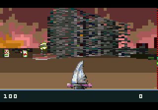

# Anarch for the Sega 32X

Sega 32X port by gameblabla (2023)

This is a quick an dirty port of Anarch Miloslav Ciz (drummyfish) for the Sega 32X.
The hardware is well suited for this kind of game and it runs... mostly well.
Untested on real hardware though, because i don't own a real 32X.

I've also ported this game to the Sega Saturn here :
[Saturn port](https://github.com/gameblabla/anarch_saturn_cart)

This port has sound effects as well as music, which is different from the original Anarch
and were downloaded from ModArchive.

# Releases

You can download PAL & NTSC builds in the Github releases page.

# Source code

run "make" in src-md
also run "make" in libxmp as it is being used as a dependency for sound playback.
Then you can simply run "make" in the main directory.

If you want to build a PAL rom, do "make PAL=YES" instead.

Make sure to correct the checksum for the final ROM !

